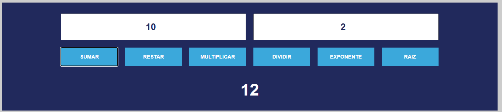

# Proyecto: Calculadora Web en JavaScript

## Descripción
Este proyecto es el template para hacer una **calculadora web básica** desarrollada con **HTML, CSS y JavaScript**.  
Actualmente solo tiene el HTML y el disño en CSS, y tu tarea será **realizar las funciones restantes**.

El proyecto forma parte de la práctica del curso de *Desarrollo Web*, donde aplicaremos conceptos de:
- Variables y funciones en JavaScript  
- Manipulación del DOM  
- Eventos y manejo de formularios  
- Validación de entradas del usuario  

---

## 🚀 Instrucciones

1. **Clona** este repositorio en tu computadora:
   ```bash
   git clone https://github.com/IDAI-NE-MA2025/richard-calculadora.git

---

## 🚀 Ejemplo de Suma



En la imagen anterior, podemos ver como de lado izquierdo se debe de escribir un numero y del lado derecho se colocará el otro numero.
El usuario podra dar click a un botón y mostrará el resultado. Actualmente se muestra en la página web, pero si lo muestran con un alert, lo doy por bien.
